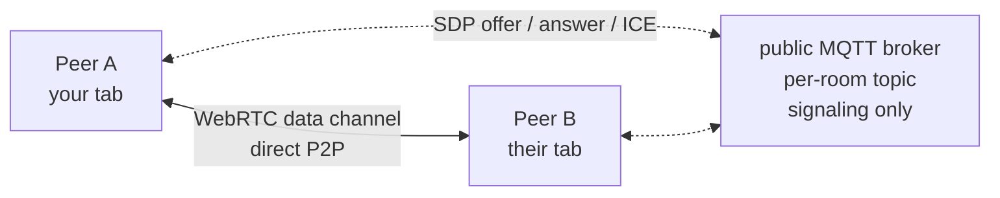

<div align="center">

[](https://www.npmjs.com/package/n2-mesh)
[](https://github.com/BartoszOsiej/n2-mesh/pkgs/container/n2-mesh)
[](https://bartoszosiej.github.io/n2-mesh/)
[](LICENSE)

**Serverless peer-to-peer chat that runs on static hosting.**
No server, no database, no accounts — just WebRTC and a public MQTT broker
used only for signaling.

**→ [Open the live app](https://bartoszosiej.github.io/n2-mesh/)**

</div>

## How it works



1. **Peers announce presence** on a per-room MQTT topic (no account)
2. Two peers see each other → exchange **WebRTC offer/answer/ICE candidates** through that topic — the broker only *introduces* peers, it never sees message payloads
3. Once connected, messages travel over the **WebRTC data channel** directly between browsers — real peer-to-peer
4. On networks that block WebRTC (mobile CGNAT), messages flow through MQTT as automatic fallback; recipients deduplicate by message id

> [!NOTE]
> **Why not WebTorrent trackers?** The original build used public WebTorrent
> WebSocket trackers. Verified live: those trackers accept announces and see
> the swarm (`complete=2`) but **no longer relay WebRTC offers** between peers.
> Since browser WebTorrent can only use WebSocket trackers, P2P was dead.
> MQTT signaling keeps the app fully serverless and matches how real messengers do it.

## Features

- 🔗 **Rooms** — same room name = same signaling topic = same peer group
- 💬 **True P2P messages** — over WebRTC data channels, with MQTT fallback
- 🏷️ Nicknames, peer counter, connection status
- 🔗 Shareable room links (`#/room-name`)
- 🌙 Dark UI, keyboard accessible, zero dependencies (no CDN, no build step)

<details>
<summary><b>📁 Files & running locally</b></summary>

| File | Purpose |
|---|---|
| `index.html` | Single-page shell |
| `app.js` | Networking (WebRTC + MQTT signaling) — zero dependencies |
| `style.css` | Dark aurora theme |

```bash
python3 -m http.server 8080
# open http://localhost:8080 (and a second tab to chat with yourself)
```

Push to `main` — GitHub Actions publishes to GitHub Pages automatically.

</details>

> [!CAUTION]
> Demo-grade mesh: peers must be online simultaneously. No history — when you
> leave, the room is gone.

---

<div align="center">

**Part of [BartoszOsiej](https://github.com/BartoszOsiej)'s portfolio** · [Docs](https://bartoszosiej.github.io/Docs/projects/n2-mesh/)

MIT © 2026 Bartosz Osiej

</div>
