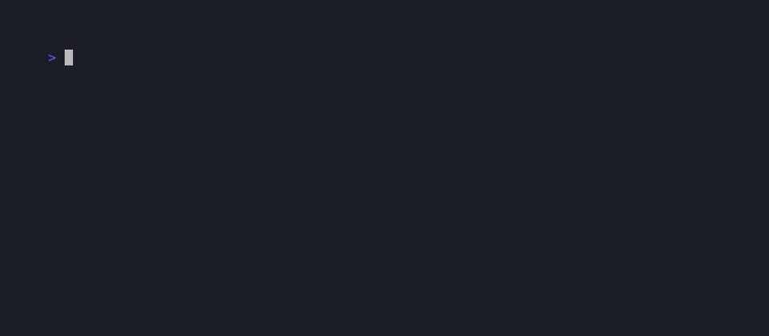
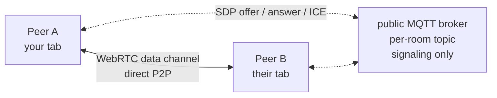

[](https://securityscorecards.dev/viewer/?uri=github.com/BartoszOsiej/n2-mesh)

**Serverless peer-to-peer chat that runs on static hosting (GitHub Pages).**
No server, no database, no accounts — just WebRTC and a public MQTT broker
used only for signaling.

> 🇵🇱 [Wersja polska](README.pl.md) · [Documentation](https://bartoszosiej.github.io/Docs/projects/n2-mesh/) · [Live Demo](https://bartoszosiej.github.io/n2-mesh/)

---

## Table of Contents

- [Demo](#-demo)
- [How it works](#how-it-works)
- [Features](#features)
- [Quick Start](#quick-start)
- [Deploy](#deploy)
- [Architecture](#architecture)
- [Tests](#tests)
- [Security](#security)
- [License](#license)

---

## 📺 Demo


<!-- VHS auto-rendered — run: vhs demos/n2-mesh.tape -->





## How it works



1. **Peers announce their presence** on a per-room MQTT topic (no account,
   public broker — the same way messengers discover each other).
2. When two peers see each other, they exchange **WebRTC offer/answer/ICE
   candidates** through that topic. The broker only *introduces* peers — it
   never sees message payloads.
3. Once connected, chat messages travel over the **WebRTC data channel**
   directly between browsers — real peer-to-peer.
4. On networks that block WebRTC (mobile carrier CGNAT), messages still flow
   through the MQTT topic as an automatic fallback.

### Why not WebTorrent trackers?

Public WebTorrent WebSocket trackers no longer relay WebRTC offers between
peers. Signaling over the MQTT relay keeps the app fully serverless, works
today, and matches how real messengers do it.

---

## Features

| Feature | Description |
|---|---|
| 🔗 **Rooms** | Same room name = same signaling topic = same peer group |
| 💬 **True P2P** | WebRTC data channels, MQTT fallback |
| 🏷️ **Nicknames** | Peer counter, connection status |
| 🔗 **Shareable links** | `#/room-name` hash-based routing |
| 🌙 **Dark UI** | Keyboard accessible, zero dependencies |
| 📦 **Zero build** | No CDN, no build step, no npm needed |

---

## Quick Start

```bash
# Local dev
python3 -m http.server 8080
# Open http://localhost:8080 (and a second tab to chat with yourself)

# Docker
docker build -t n2-mesh .
docker run -p 8080:80 n2-mesh
```

---

## Deploy

Push to `main` — GitHub Actions (`deploy.yml`) publishes to GitHub Pages
automatically.

### Docker (GHCR)

```bash
# Build
docker build -t ghcr.io/bartoszosiej/n2-mesh:latest .

# Or pull (after CI tag push)
docker pull ghcr.io/bartoszosiej/n2-mesh:latest
docker run -p 8080:80 ghcr.io/bartoszosiej/n2-mesh:latest
```

---

## Architecture

| File | Purpose |
|---|---|
| `index.html` | Single-page shell |
| `app.js` | Networking (WebRTC + MQTT signaling) — zero dependencies |
| `core.js` | Pure logic layer (bytes, message ids, dedup, MQTT 3.1.1 codec) — testable without a browser |
| `style.css` | Dark aurora theme |

---

## Tests

The messaging logic lives in `core.js` so it can be exercised headlessly.
The suite is **49/49 green** (`npm test`, Node's built-in `node:test`, no
dependencies):

- `tests/core.test.js` (22) — functional: bytes, message ids, dedup, room parsing, MQTT packet round-trips
- `tests/core.rigorous.test.js` (27) — rigorous: fuzz + property tests on a deterministic PRNG

Coverage highlights: every MQTT 3.1.1 remaining-length boundary, 5 000 random
encode→decode round-trips, 5 000 garbage buffers (never throw), 200 000
generated message ids without a single collision.

```bash
npm test          # 49/49 ✓
```

---

## Security

- Messages travel **peer-to-peer** over WebRTC data channels whenever possible
- MQTT broker performs signaling and is used as a fallback transport only
- This is a demo-grade mesh: peers must be online simultaneously

---

## License

MIT — do whatever you want with it.

---
